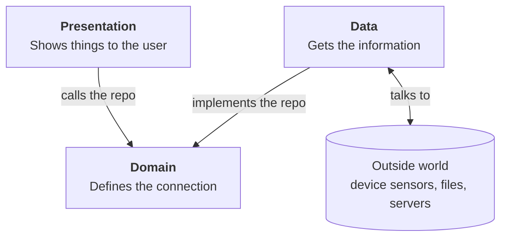

# App architecture

The codebase is organized in two steps. First it is grouped by **feature**. Then each feature is split into three **layers**: domain, data and presentation. This page explains those two ideas, then shows how the current code follows them.

## Features

A feature is one general thing the app can do for the user. Each feature gets its own folder under `lib/features/`, and everything that feature needs lives in that folder.

This keeps related code together:

- To change how something works, you look in one folder instead of searching the whole app.
- Two people can work on different features without editing the same files.
- A feature can be removed, or rewritten, without touching the others.

Features can use each other. For example, the map shows your location, so it uses the location feature.

## Layers inside a feature

Inside a feature, code is split by what job it does:



| Layer | Its job | What goes in it |
| --- | --- | --- |
| Domain | Define what the app works with and what it can ask for. | **Models** and **repositories** (see below). Definitions only: no UI, and no code that talks to the outside world. |
| Data | Get information from the outside world and turn it into domain models. | **Repository implementations**: the code that really reads GPS, loads a file or calls a server. Each outside format (a plugin's type, a server's JSON) is converted into a domain model here. |
| Presentation | Show things to the user and react to what they do. | **Cubits**: hold what the screen should show right now. **Widgets**: draw it and pass taps back to the cubit. |

### The domain layer holds the definitions

The domain layer is where the definitions live. Data and presentation both build on these definitions. The domain holds two kinds of things:

- **Models** define the objects the app works with, such as a location or a building. They hold information and nothing else.
- **Repositories** are contracts. A repository is a group of methods, like a small API, that says what the app can ask for. For example: "watch the user's location", or "list the campus buildings". It says what each method takes and returns, but not how the work is done. In Dart, it's written as an `abstract class`.

The repository is the glue between the other two layers:

- The **data** layer provides the repository (by `implement`ing the abstract repo). It writes the code behind each method.
- The **presentation** layer uses the repository. It calls the methods and doesn't know or care how they work.

Once a repository's methods are agreed, the two sides can be built independently, even by different people at the same time. The UI can be built and tested against a fake repository before the real data code exists. The data source can be replaced, for example a bundled file swapped for a server, without changing any screen.

**The rule to remember:** domain code never imports from data or presentation. It also never imports Flutter or plugins.

Not every feature needs all three layers. Leave out any layer that would be empty.

## How the current code follows this

The app has two features today:

- **location:** finds where the user is.
- **map:** shows the campus map and draws the user's location on it.

| Layer | In the location feature |
| --- | --- |
| Domain | `UserLocation` (a point plus its accuracy), `LocationFailure` (GPS off or permission denied), and the `LocationRepository` contract |
| Data | `GeolocatorLocationRepository` implements `LocationRepository` using the Flutter package `geolocator` |
| Presentation | `LocationCubit` holds the current state. `LocationErrorDialog` explains failures. |

The map feature only has a presentation layer, because it has no data of its own yet. It reads the location from `LocationCubit`.

`main.dart` is the one place that decides which repository implementation the app uses. Tests pass in a mocked implementation instead.

## Cubits and states

A cubit is a small class from the `flutter_bloc` package. It holds one piece of state, and widgets redraw when that state changes.

- Widgets call methods on the cubit, such as `start()` or `retry()`.
- The cubit calls the repository and `emit`s a new state.
- Widgets wrapped in `BlocBuilder` or `BlocConsumer` redraw with the new state.

The state is a fixed list of cases (a Dart `sealed` class), so the screen is always in exactly one of them:

| State | Meaning | What the map shows |
| --- | --- | --- |
| `LocationLoading` | Waiting for permission or the first GPS fix | Campus map only |
| `LocationTracking(location)` | We have a position | Blue dot and accuracy circle |
| `LocationUnavailable(failure)` | GPS is off or permission was denied | Error dialog with buttons to fix it |

Not everything goes in a cubit. State that only one widget cares about stays in that widget. For example, `MapPage` keeps the map camera (`MapController`) to itself.

## How a location update reaches the screen

1. On launch, `main.dart` creates a `GeolocatorLocationRepository` and a `LocationCubit`, then calls `start()`.
2. The cubit calls `repository.watchLocation()`.
3. The repository checks that GPS is on and asks for permission. If either check fails, it sends a `LocationException` (for example, `permissionDenied`).
4. Otherwise it listens to the GPS plugin and converts each reading into a `UserLocation`.
5. For each update, the cubit emits `LocationTracking(location)`. For an error, it emits `LocationUnavailable(failure)`.
6. `MapPage` redraws. It shows the blue dot while tracking and the error dialog when location is unavailable. On the first location, it also moves the camera there.
7. Tapping **Try again** calls `cubit.retry()`. That goes back to loading and starts over at step 2.

## Where things live

```
app/lib/
  main.dart                          Creates the repository and cubit, starts the app
  features/
    location/
      domain/
        location_repository.dart     The contract: what the app can ask about location
        models/                      UserLocation, LocationFailure, LocationException
      data/
        geolocator_location_repository.dart   The real implementation, using GPS
      presentation/
        cubit/                       LocationCubit and LocationState
        location_error_dialog.dart   Error message and buttons to fix it
    map/
      presentation/
        map_page.dart                The main screen
        user_location_layers.dart    Blue dot and accuracy circle
app/test/
  mocks/mock_location_repository.dart   Fake repository that tests control by hand
  features/...                          Same layout as lib/
```

## Adding a feature

Using "building info" as an example:

1. Create `lib/features/buildings/` with `domain/`, `data/` and `presentation/` folders.
2. **Domain:** define the models (`Building`) and the repository contract (`BuildingRepository`): the methods the screens will need. Agree on this first, then data and presentation can be built in parallel.
3. **Data:** add a class that implements the repository using the real source, such as a JSON file, an API or a plugin. Convert outside types into your models here.
4. **Presentation:** add a sealed state class, a cubit that calls the repository, and the widgets.
5. **Wire it up in `main.dart`:** add a `RepositoryProvider` for the repository and a `BlocProvider` for the cubit. If several screens share the cubit, put it at the top of the app. If only one screen uses it, put it around that screen.
6. **Test it:** add a mock repository in `test/mocks/`, then write cubit tests and widget tests.

Skip any layer that would be empty. For example, a simple on/off setting may only need presentation.

## Testing

Run `flutter test` from `app/`. Tests never use real GPS. Instead they use `MockLocationRepository`, which a test drives by hand with `emitLocation(...)` and `fail(LocationFailure.permissionDenied)`.

**Cubit tests** use `bloc_test`. You call cubit methods, feed the mock, and list the states you expect. No UI is involved.

```dart
blocTest<LocationCubit, LocationState>(
  'emits the failure when location is unavailable',
  build: () => LocationCubit(repository),
  act: (cubit) {
    cubit.start();
    repository.fail(LocationFailure.permissionDenied);
  },
  expect: () => [const LocationUnavailable(LocationFailure.permissionDenied)],
);
```

**Widget tests** build `MainApp` with the mock and check what's on screen. After the mock sends something, call `pumpLocationUpdate(tester)`. It runs two frames: the first gets the update to the cubit, and the second redraws the screen.

`GeolocatorLocationRepository` has no automated tests because it calls the GPS plugin directly. Check it on a real device.